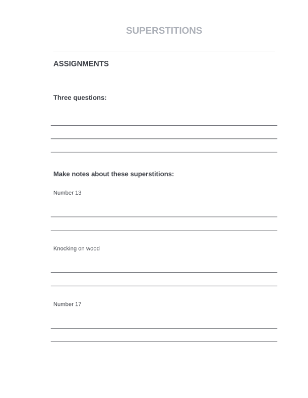
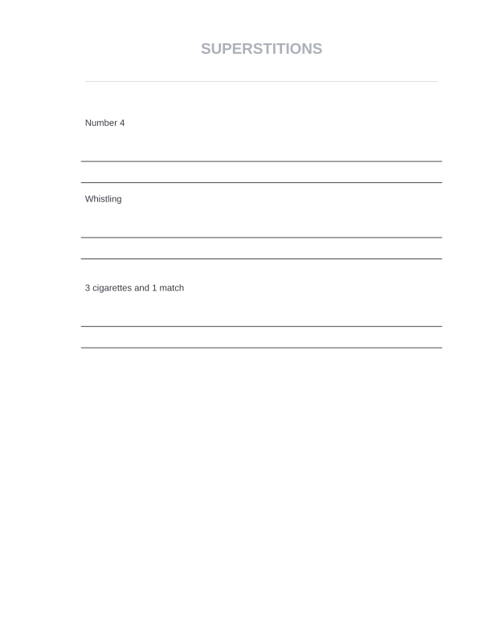

# Superstitions 

## Specification

|              |                                 |
| ------------ | ------------------------------- |
| **Level**    | B1-C1                           |
| **Category** | speaking games                  |
| **Type**     | listening, reading and speaking |
| **Time**     | 90 min                          |

## Plan

**1**. Ask your students what they usually do when a black cat crosses the road and if they are scared of _**number 13**_. 
Besides you may discuss what brings good and bad luck.

**2**. Tell your students that they are going to watch one video about the origin of some superstitions. Ask them to watch first 20 sec of the video and write down three questions that are asked by the speaker.

**3**. Play the video twice. [TED: Where do superstitions come from? - Stuart Vyse](https://www.youtube.com/watch?v=quOdF1CAPXs)

**4**. Check the questions:

 1. Are you afraid of black cats?
 2. Would you open an umbrella indoors?
 3. How do you feel about _**the number 13**_?

**5**. Ask your students to work in pairs and discuss the questions. Hold a plenary discussion.

**6**. Tell your students that they are going to finish watching the video. Write some words from the video that might be difficult for your students.

**7**. Give your students the papers for their notes and ask them to make notes about superstitions and their origin.

**8**. Play the video once or twice and let your students discuss the details in pairs first.

**9**. Use the key words from the papers and discuss all the details. Ask them if they believe in these superstitions.

**10**. Tell your students that they are going to read some more information about different superstitions.

**11**. Ask them to use their mobile phones and give them the link. [The Insider: 20 bizarre superstitions from around the world and the meaning behind them](https://www.thisisinsider.com/superstitions-around-the-world-2017-9)

## Optional

> You may discuss some words from the article first.

**12**. Let your students choose one country and give them 10 min to read. After that ask them to present the information in groups of 2-3.

**13**. Hold a plenary discussion on the topic.

## Assignments

## License

